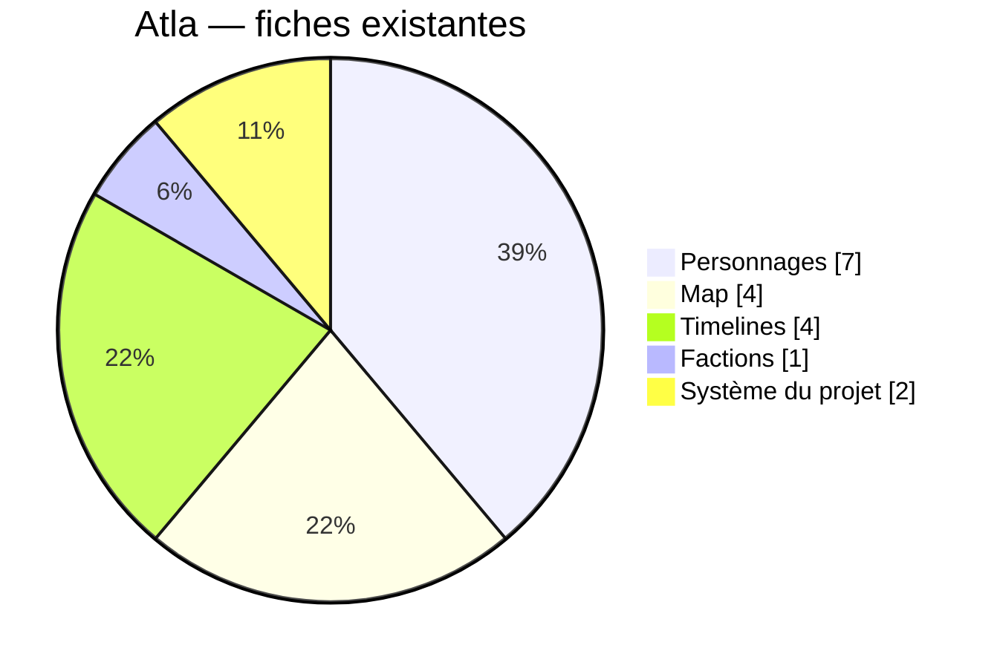

# Atla

Inventaire des fiches existantes du projet, mesuré le **21 août 2026**.

Atla compte **18 fiches** réparties en cinq catégories.

## Camembert

- Plateau visuel : [Atla.svg](./Atla.svg) · [Atla.png](./Atla.png)
- Données : [Atla.json](./Atla.json)
- Code du diagramme : [code/](./code/)

## Répartition

| Catégorie | Fiches | Part |
| --- | ---: | ---: |
| Personnages | 7 | 38,9 % |
| Map | 4 | 22,2 % |
| Timelines | 4 | 22,2 % |
| Système du projet | 2 | 11,1 % |
| Factions | 1 | 5,6 % |
| **Total** | **18** | **100 %** |

## Détail des fiches

### Personnages — 7

- Stella Bellarosa — Principaux
- Myriam Bellarosa — Principaux
- Antoine Bellarosa — Principaux
- Le Traqueur — Secrets
- L'Homme en Rouge — Secrets
- Mylo — Enjeux · École
- Gaston — Enjeux · Voisinage

### Map — 4

- Magasin BIO — Lieux
- Côtebelle — Villes
- Anse-les-Vagues — Villes
- Maison des Bellarosa — Habitations

### Timelines — 4

- Fuite originelle — Périodes clés
- L'Homme Volant — Périodes clés
- Scènes Fuite Originelle — Scènes
- Scènes L'Homme Volant — Scènes

### Factions — 1

- Lignée Bellarosa — Lignées

### Système du projet — 2

- Projet L'Homme Volant — Projet
- Mécanismes du gameplay — Implémentation

## Code

Sources du camembert, copiées pour le projet :

| Fichier | Rôle |
| --- | --- |
| [code/atla.ts](./code/atla.ts) | Données et catégories |
| [code/atla-pie.tsx](./code/atla-pie.tsx) | Camembert interactif (Recharts) |
| [Atla-export.ts](./Atla-export.ts) | Export SVG du plateau |
| [code/README.md](./code/README.md) | Mode d'emploi |

## Périmètre

Atla mesure uniquement les cinq catégories demandées. Hors camembert : archives des bases de données, dossiers BASES (guides / modèles / compétences), pistes audio, et l’app Aléa.

Hors périmètre, 1 archive existe déjà : *Cassette gouvernementale sur la neutralisation des supes super-puissants*.
